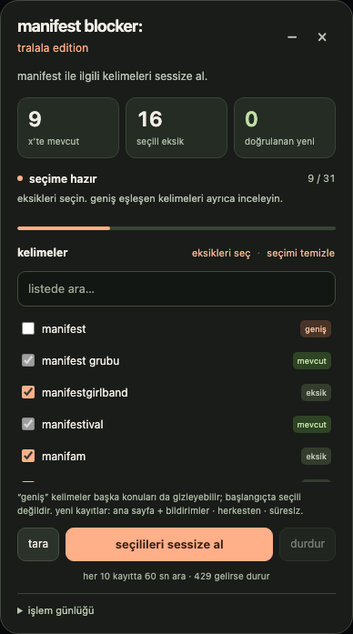

# manifest blocker: tralala edition

x’in sessize alınan kelimeler sayfasında çalışan küçük, sürüklenebilir bir console paneli. kurulum, eklenti veya api anahtarı gerekmez.



## kullan

1. [manifest-blocker.js](manifest-blocker.js) dosyasının tamamını kopyala. alternatif olarak [index.html](index.html) dosyasını indirip tarayıcıda aç ve **kodu kopyala** düğmesine bas.
2. oturumun açıkken [x’in kelime listesine](https://x.com/settings/muted_keywords) git. kelime ekleme formundaysan önce listeye dön.
3. console’u aç: chrome/mac için `⌘⌥j`, chrome/windows için `ctrl+shift+j`. kodu yapıştır ve enter’a bas.
4. tarama bittikten sonra eksik kelimeleri seç ve **seçilileri sessize al** düğmesine bas.

ilk tarama kendiliğinden başlar; başlat düğmesine basılmadan kelime kaydedilmez. yeni kod, durmuş eski paneli değiştirir. çalışan paneli önce durdurmak gerekir.

## neler var?

- manifest ile ilgili 31 kelime; mevcut kayıtları tespit edip atlama.
- sanal listeleri kaydırarak okuma; tanınmayan veya kısmi listede durma.
- kaydetme isteğinin sunucu yanıtını ve kelimenin x listesinde görünmesini birlikte doğrulama.
- her 10 doğrulanmış yeni kayıttan sonra 60 saniye ara; kelimeler arasında en az 2 saniye.
- 429’da durma; sunucunun bekleme süresine uyma ve yalnızca sen devam ettiğinde yeniden deneme.
- durdur / devam et, işlem günlüğü, arama, seçim temizleme, sürükleme, küçültme ve kaldırma.
- tamamen küçük harfli metinler; logosuz, kömür grisi ve sıcak turuncu arayüz.

`manifest`, `toz pembe` gibi geniş eşleşen kelimeler başlangıçta seçili değildir. **eksikleri seç** bunları da seçer. yalnızca tam kelime/ifade eşleşmeleri mevcut sayılır.

## v2.0.0 düzeltmesi

ingilizce x formunda süresiz seçeneği **“until you unmute the word”** olarak gösteriliyor. bu etiket, “until you unmute this word”, “forever” ve türkçe karşılıklarıyla birlikte desteklenir. bildirimler için anahtar türündeki kontroller de tanınır. tanınmayan bir seçenek hatası artık kullanıcıyı dil değiştirmeye yönlendirmez.

x’in normal bağlantı adresi içermeyen, içinde “unmute” düğmesi bulunan kelime satırları da desteklenir. bu düğmelere tıklanmaz.

## kayıt ve bekleme davranışı

bir kelimeyi yeni kayıt olarak saymak için bu kaydetme isteğine ait başarılı yanıtta kelime ve kayıt kimliği bulunmalı, uygulama hatası olmamalı ve kelime x listesinde görünmelidir. yalnızca düğmeye basılması, http 200 alınması veya kelimenin geçici olarak görünmesi başarı değildir.

yeni kayıtlar **ana sayfa + bildirimler / herkesten / süresiz** olarak ayarlanır; seçenekler kaydetmeden önce kontrol edilir. mevcut kayıtların ayarları değiştirilmez.

başarılı kayıt sayacından bağımsız olarak deneme sayısı da 10’a ulaştığında ara verir. böylece belirsiz veya reddedilmiş isteklerden sonra gerektiğinde ek bir bekleme uygulanır. sayımlar ve bekleme bitişi aynı sekmenin `sessionStorage` alanında korunur. depolama engelliyse kalıcılık yalnızca açık panel oturumu için geçerlidir. aynı anda tek sekmede kullan.

429 geldiğinde `retry-after` veya `x-rate-limit-reset` süresi beklenir; yoksa en az 60 saniye bırakılır. sürenin dolması otomatik yeniden deneme yapmaz ve sınırın kalktığını garanti etmez. **devam et** önce listeyi yeniden tarar.

sonucu belirsiz kelime **kontrol et** olarak işaretlenir ve aynı sayfa oturumunda otomatik tekrar gönderilmez. x listesini yenile, kodu tekrar yapıştır ve yeni taramaya göre ilerle. gönderilmiş istek durdurularak geri alınamaz; panel yeni kayıt göndermeyi bırakıp son isteği doğrulamaya çalışır.

## kontroller

| kontrol | davranış |
| --- | --- |
| tara | mevcut listeyi yeniden okur |
| durdur | yeni kayıt göndermeyi bırakır |
| devam et | listeyi yeniden tarayıp seçili eksiklerden devam eder |
| − | paneli küçültür; çalışma devam eder |
| × | durdurup paneli ve kendi ağ gözlemcilerini kaldırır; x’teki kayıtlar kalır |
| günlüğü temizle | yalnızca günlük satırlarını siler; sayaç ve beklemeler korunur |

console’dan da kontrol edebilirsin:

```js
manifestblocker.stop();
manifestblocker.resume();
manifestblocker.scan();
manifestblocker.show();
manifestblocker.status();
manifestblocker.dismiss();
```

## gizlilik ve uyum

script x’in mevcut web formunu kullanır. kendi api isteğini oluşturmaz, çerez/kimlik doğrulama bilgilerini okumaz, dışarıya veri göndermez veya uzaktan kod yüklemez. `fetch` ve `XMLHttpRequest` geçici olarak gözlemlenir; panel kapatılınca kendi değişiklikleri geri alınır.

liste satırları ve ingilizce süre etiketi gerçek x ekranında salt okunur incelendi. kaydetme, hata, bekleme ve arayüz senaryoları benzetilmiş sayfalar ve yanıtlarla chromium’da test edildi. gerçek x hesabında test kaydı yapılmadı. x’in arayüzü veya sunucu yanıtı değişirse araç tahmin ederek devam etmek yerine durur.

bu araç kelimeleri sessize alır; hesap engellemez. [x’in açıklamasına göre](https://help.x.com/en/using-x/advanced-x-mute-options) arama sonuçları sessize alma kapsamı dışındadır. önizleme örnek veri içerir.

## geliştirme

node.js 20 veya daha yeni bir sürüm gerekir. scripti kullanmak için bu adımlar gerekli değildir.

```sh
npm ci
npx playwright install chromium
npm run check
npm test
npm run build
```

`manifest-blocker.js` tek kaynak dosyasıdır. `npm run build`, bu kodu kopyalama sayfasına gömer. `scripts/page-template.html` sayfa şablonudur. testler tüm ağ isteklerini yerel örneklerle karşılar; gerçek x hesabına bağlanmaz.

test ekran görüntüleri ve raporları `.test-artifacts/` altında kalır ve git’e eklenmez.
